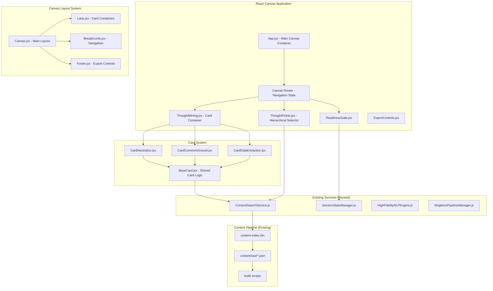
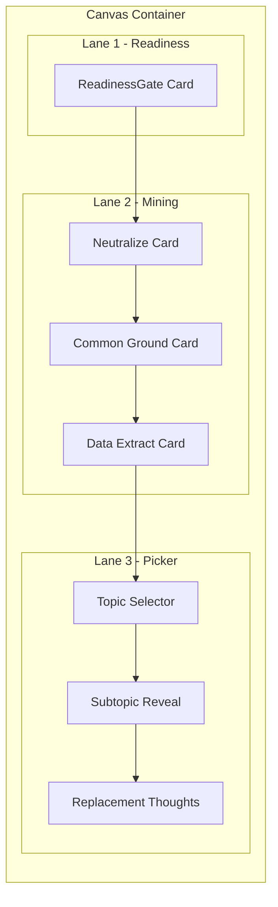

# Clarity Canvas Design Document

## Overview

Clarity Canvas implements a card-based, canvas-style therapeutic interface using React components with a privacy-first, offline-capable architecture. The system provides a non-linear, tactile user experience through interactive cards organized in lanes, powered by on-device AI and semantic search of therapeutic content. The design emphasizes user agency, ephemerality, and gentle guidance through structured therapeutic processes.

## Architecture

### High-Level Architecture



### Canvas Layout System

The canvas uses a flexible lane-based layout where cards can be arranged dynamically:



## Components and Interfaces

### Core Canvas Components

#### 1. App.jsx - Main Application Container
```javascript
const App = () => {
  const [canvasState, setCanvasState] = useState({
    currentLane: 'readiness',
    completedCards: [],
    userJourney: [],
    isReady: false,
    needsExtraction: false,
    selectedTopic: null,
    minedInsights: []
  });
  
  return (
    <div className="clarity-canvas">
      <Canvas state={canvasState} onStateChange={setCanvasState} />
      <Footer>
        <ExportControls insights={canvasState.minedInsights} />
      </Footer>
    </div>
  );
};
```

#### 2. Canvas.jsx - Main Layout Container
```javascript
const Canvas = ({ state, onStateChange }) => {
  return (
    <div className="canvas-container">
      <Breadcrumb journey={state.userJourney} onNavigate={handleNavigate} />
      <div className="canvas-lanes">
        {state.currentLane === 'readiness' && (
          <Lane id="readiness-lane">
            <ReadinessGate onReady={handleReadiness} />
          </Lane>
        )}
        
        {state.currentLane === 'mining' && (
          <Lane id="mining-lane">
            <ThoughtMining 
              topic={state.selectedTopic}
              onComplete={handleMiningComplete}
            />
          </Lane>
        )}
        
        {state.currentLane === 'picker' && (
          <Lane id="picker-lane">
            <ThoughtPicker 
              onSelection={handleThoughtSelection}
            />
          </Lane>
        )}
      </div>
    </div>
  );
};
```

### Card System Components

#### 3. BaseCard.jsx - Shared Card Foundation
```javascript
const BaseCard = ({ 
  title, 
  children, 
  isActive, 
  isCompleted, 
  onActivate, 
  onComplete,
  loading = false,
  error = null,
  testId
}) => {
  return (
    <div 
      className={`card ${isActive ? 'active' : ''} ${isCompleted ? 'completed' : ''}`}
      data-testid={testId}
      role="region"
      aria-label={title}
    >
      <div className="card-header">
        <h3>{title}</h3>
        {isCompleted && <span className="completion-indicator">✓</span>}
      </div>
      
      <div className="card-content">
        {loading && <Spinner message="Loading prompts..." />}
        {error && (
          <ErrorState 
            message={error} 
            onRetry={() => window.location.reload()} 
          />
        )}
        {!loading && !error && children}
      </div>
      
      <div className="card-actions">
        {!isCompleted && (
          <button 
            className="btn-primary"
            onClick={onComplete}
            disabled={loading}
          >
            Complete This Step
          </button>
        )}
        <button 
          className="btn-secondary"
          onClick={() => onActivate(false)}
        >
          Skip For Now
        </button>
      </div>
    </div>
  );
};
```

#### 4. CardNeutralize.jsx - Voice Neutralization Card
```javascript
const CardNeutralize = ({ topic, onComplete, isActive }) => {
  const [prompts, setPrompts] = useState([]);
  const [loading, setLoading] = useState(false);
  const [error, setError] = useState(null);
  const [selectedPrompt, setSelectedPrompt] = useState(null);
  
  useEffect(() => {
    if (isActive && topic) {
      loadNeutralizePrompts();
    }
  }, [isActive, topic]);
  
  const loadNeutralizePrompts = async () => {
    try {
      setLoading(true);
      const neutralizePrompts = await contentSearchService.getMiningPrompts(
        topic, 
        'neutralize'
      );
      setPrompts(neutralizePrompts);
      setError(null);
    } catch (err) {
      setError('Failed to load neutralization prompts');
      console.error('Error loading neutralize prompts:', err);
    } finally {
      setLoading(false);
    }
  };
  
  const handlePromptSelect = (prompt) => {
    setSelectedPrompt(prompt);
  };
  
  const handleComplete = () => {
    onComplete({
      type: 'neutralize',
      selectedPrompt,
      timestamp: new Date().toISOString()
    });
  };
  
  return (
    <BaseCard
      title="Neutralize the Voice"
      isActive={isActive}
      onComplete={handleComplete}
      loading={loading}
      error={error}
      testId="card-neutralize"
    >
      <div className="neutralize-content">
        <p className="card-instruction">
          Choose a prompt that helps you separate from the emotional charge of your thought:
        </p>
        
        <div className="prompt-options">
          {prompts.map((prompt, index) => (
            <button
              key={index}
              className={`prompt-option ${selectedPrompt === prompt ? 'selected' : ''}`}
              onClick={() => handlePromptSelect(prompt)}
              data-testid={`neutralize-prompt-${index}`}
            >
              {prompt}
            </button>
          ))}
        </div>
        
        {selectedPrompt && (
          <div className="selected-prompt-display">
            <h4>Selected approach:</h4>
            <p>"{selectedPrompt}"</p>
          </div>
        )}
      </div>
    </BaseCard>
  );
};
```

#### 5. CardCommonGround.jsx - Common Ground Building Card
```javascript
const CardCommonGround = ({ topic, onComplete, isActive }) => {
  const [prompts, setPrompts] = useState([]);
  const [loading, setLoading] = useState(false);
  const [error, setError] = useState(null);
  const [insights, setInsights] = useState('');
  
  useEffect(() => {
    if (isActive && topic) {
      loadCommonGroundPrompts();
    }
  }, [isActive, topic]);
  
  const loadCommonGroundPrompts = async () => {
    try {
      setLoading(true);
      const commonGroundPrompts = await contentSearchService.getMiningPrompts(
        topic, 
        'commonGround'
      );
      setPrompts(commonGroundPrompts);
      setError(null);
    } catch (err) {
      setError('Failed to load common ground prompts');
      console.error('Error loading common ground prompts:', err);
    } finally {
      setLoading(false);
    }
  };
  
  const handleComplete = () => {
    onComplete({
      type: 'commonGround',
      insights,
      timestamp: new Date().toISOString()
    });
  };
  
  return (
    <BaseCard
      title="Build Common Ground"
      isActive={isActive}
      onComplete={handleComplete}
      loading={loading}
      error={error}
      testId="card-common-ground"
    >
      <div className="common-ground-content">
        <p className="card-instruction">
          Explore these questions to understand your thought's protective intention:
        </p>
        
        <div className="prompts-list">
          {prompts.map((prompt, index) => (
            <div key={index} className="prompt-item">
              <p className="prompt-question">{prompt}</p>
            </div>
          ))}
        </div>
        
        <div className="insights-input">
          <label htmlFor="insights-textarea">
            What insights did you discover?
          </label>
          <textarea
            id="insights-textarea"
            value={insights}
            onChange={(e) => setInsights(e.target.value)}
            placeholder="Reflect on what you learned about your thought's protective purpose..."
            data-testid="common-ground-insights"
          />
        </div>
      </div>
    </BaseCard>
  );
};
```

#### 6. CardDataExtraction.jsx - Data Mining Card
```javascript
const CardDataExtraction = ({ topic, onComplete, isActive }) => {
  const [prompts, setPrompts] = useState([]);
  const [loading, setLoading] = useState(false);
  const [error, setError] = useState(null);
  const [responses, setResponses] = useState({});
  
  useEffect(() => {
    if (isActive && topic) {
      loadDataExtractionPrompts();
    }
  }, [isActive, topic]);
  
  const loadDataExtractionPrompts = async () => {
    try {
      setLoading(true);
      const extractionPrompts = await contentSearchService.getMiningPrompts(
        topic, 
        'dataExtraction'
      );
      setPrompts(extractionPrompts);
      setError(null);
    } catch (err) {
      setError('Failed to load data extraction prompts');
      console.error('Error loading data extraction prompts:', err);
    } finally {
      setLoading(false);
    }
  };
  
  const handleResponse = (promptIndex, response) => {
    setResponses(prev => ({
      ...prev,
      [promptIndex]: response
    }));
  };
  
  const handleComplete = () => {
    onComplete({
      type: 'dataExtraction',
      responses,
      extractedData: Object.values(responses),
      timestamp: new Date().toISOString()
    });
  };
  
  return (
    <BaseCard
      title="Extract Core Data"
      isActive={isActive}
      onComplete={handleComplete}
      loading={loading}
      error={error}
      testId="card-data-extraction"
    >
      <div className="data-extraction-content">
        <p className="card-instruction">
          Answer these either/or questions to mine your thought for its core message:
        </p>
        
        <div className="extraction-prompts">
          {prompts.map((prompt, index) => (
            <div key={index} className="either-or-prompt">
              <p className="prompt-question">{prompt}</p>
              <div className="either-or-options">
                <button
                  className={`option-button ${responses[index] === 'A' ? 'selected' : ''}`}
                  onClick={() => handleResponse(index, 'A')}
                  data-testid={`extraction-option-${index}-a`}
                >
                  Option A
                </button>
                <button
                  className={`option-button ${responses[index] === 'B' ? 'selected' : ''}`}
                  onClick={() => handleResponse(index, 'B')}
                  data-testid={`extraction-option-${index}-b`}
                >
                  Option B
                </button>
              </div>
            </div>
          ))}
        </div>
        
        <div className="extraction-summary">
          <h4>Extracted Insights:</h4>
          <ul>
            {Object.values(responses).map((response, index) => (
              <li key={index}>Question {index + 1}: {response}</li>
            ))}
          </ul>
        </div>
      </div>
    </BaseCard>
  );
};
```

### Navigation and Layout Components

#### 7. ReadinessGate.jsx - Entry Point Assessment
```javascript
const ReadinessGate = ({ onReady }) => {
  const [isReady, setIsReady] = useState(null);
  const [intensity, setIntensity] = useState(5);
  const [showOffRamp, setShowOffRamp] = useState(false);
  
  const handleReadinessCheck = (ready) => {
    setIsReady(ready);
    if (!ready) {
      setShowOffRamp(true);
    } else {
      onReady({ isReady: true, intensity });
    }
  };
  
  const handleOffRampComplete = () => {
    setShowOffRamp(false);
    setIsReady(null);
  };
  
  if (showOffRamp) {
    return <CenteringExercise onComplete={handleOffRampComplete} />;
  }
  
  return (
    <BaseCard
      title="Readiness Check"
      testId="readiness-gate"
    >
      <div className="readiness-content">
        <div className="readiness-question">
          <h3>Do you feel ready to move through a thought pattern?</h3>
          <p>Are you open to the process of exploring your thoughts?</p>
          
          <div className="readiness-buttons">
            <button
              className="btn-primary"
              onClick={() => handleReadinessCheck(true)}
              data-testid="readiness-yes"
            >
              Yes, I'm ready
            </button>
            <button
              className="btn-secondary"
              onClick={() => handleReadinessCheck(false)}
              data-testid="readiness-no"
            >
              Not right now
            </button>
          </div>
        </div>
        
        <div className="intensity-assessment">
          <label htmlFor="intensity-slider">
            Current emotional intensity (0-10):
          </label>
          <input
            id="intensity-slider"
            type="range"
            min="0"
            max="10"
            value={intensity}
            onChange={(e) => setIntensity(parseInt(e.target.value))}
            data-testid="intensity-slider"
          />
          <div className="intensity-display">
            <span>0 - Calm</span>
            <span>{intensity}</span>
            <span>10 - Overwhelming</span>
          </div>
        </div>
      </div>
    </BaseCard>
  );
};
```

#### 8. ThoughtMining.jsx - Mining Card Container
```javascript
const ThoughtMining = ({ topic, onComplete }) => {
  const [activeCard, setActiveCard] = useState('neutralize');
  const [completedCards, setCompletedCards] = useState([]);
  const [miningResults, setMiningResults] = useState({});
  
  const handleCardComplete = (cardType, result) => {
    setMiningResults(prev => ({
      ...prev,
      [cardType]: result
    }));
    
    setCompletedCards(prev => [...prev, cardType]);
    
    // Progress to next card or complete mining
    if (cardType === 'neutralize') {
      setActiveCard('commonGround');
    } else if (cardType === 'commonGround') {
      setActiveCard('dataExtraction');
    } else if (cardType === 'dataExtraction') {
      onComplete(miningResults);
    }
  };
  
  const canExit = completedCards.length > 0;
  
  return (
    <div className="thought-mining-container">
      <div className="mining-header">
        <h2>Thought Mining Process</h2>
        <div className="mining-progress">
          {['neutralize', 'commonGround', 'dataExtraction'].map(cardType => (
            <div
              key={cardType}
              className={`progress-dot ${
                completedCards.includes(cardType) ? 'completed' : 
                activeCard === cardType ? 'active' : 'pending'
              }`}
            />
          ))}
        </div>
        
        {canExit && (
          <button
            className="btn-secondary exit-mining"
            onClick={() => onComplete(miningResults)}
          >
            I have what I need
          </button>
        )}
      </div>
      
      <div className="mining-cards">
        <CardNeutralize
          topic={topic}
          isActive={activeCard === 'neutralize'}
          onComplete={(result) => handleCardComplete('neutralize', result)}
        />
        
        <CardCommonGround
          topic={topic}
          isActive={activeCard === 'commonGround'}
          onComplete={(result) => handleCardComplete('commonGround', result)}
        />
        
        <CardDataExtraction
          topic={topic}
          isActive={activeCard === 'dataExtraction'}
          onComplete={(result) => handleCardComplete('dataExtraction', result)}
        />
      </div>
    </div>
  );
};
```

## Data Models

### Canvas State Model
```javascript
const CanvasState = {
  // Navigation
  currentLane: 'readiness' | 'mining' | 'picker',
  userJourney: [
    {
      lane: 'readiness',
      timestamp: '2025-07-28T10:00:00Z',
      completed: true
    }
  ],
  
  // Readiness Assessment
  isReady: boolean,
  intensity: number, // 0-10
  
  // Thought Mining
  needsExtraction: boolean,
  selectedTopic: string | null,
  miningResults: {
    neutralize: {
      type: 'neutralize',
      selectedPrompt: string,
      timestamp: string
    },
    commonGround: {
      type: 'commonGround', 
      insights: string,
      timestamp: string
    },
    dataExtraction: {
      type: 'dataExtraction',
      responses: object,
      extractedData: array,
      timestamp: string
    }
  },
  
  // Thought Picker
  selectedCategory: string | null,
  selectedSubcategory: string | null,
  selectedThoughts: array,
  
  // Export Data
  minedInsights: array,
  exportableData: object
};
```

### Card Interaction Model
```javascript
const CardState = {
  id: string,
  type: 'neutralize' | 'commonGround' | 'dataExtraction' | 'picker',
  isActive: boolean,
  isCompleted: boolean,
  loading: boolean,
  error: string | null,
  data: object, // Card-specific data
  userInput: object, // User responses/selections
  timestamp: string
};
```

## Error Handling

### Content Loading Failures
- **Graceful Degradation**: Cards display friendly error messages with retry buttons
- **Fallback Content**: Generic prompts available when ContentSearchService fails
- **Offline Resilience**: Cached content used when network unavailable

### Model Loading Failures  
- **Progressive Enhancement**: Core functionality works without AI models
- **Clear Messaging**: Users informed when AI features unavailable
- **Manual Alternatives**: Text-based alternatives when models fail

### User Experience Errors
- **State Recovery**: Canvas state preserved during errors
- **Navigation Safety**: Breadcrumbs allow recovery from broken states
- **Data Protection**: User insights preserved even during technical issues

## Testing Strategy

### Component Testing
- **Card Isolation**: Each card component tested independently
- **Service Mocking**: ContentSearchService mocked for predictable testing
- **State Management**: Canvas state transitions tested thoroughly
- **Error Scenarios**: All error states and recovery paths tested

### Integration Testing
- **End-to-End Flows**: Complete user journeys from readiness to export
- **Content Pipeline**: Integration with existing content system verified
- **Cross-Browser**: Canvas functionality tested across modern browsers
- **Accessibility**: Full keyboard navigation and screen reader support

### Performance Testing
- **Load Times**: Canvas initialization under performance budget
- **Memory Usage**: Card creation/destruction doesn't leak memory
- **Responsive Design**: Canvas adapts to all screen sizes
- **Model Loading**: AI processing doesn't block UI interactions

## Implementation Considerations

### Reusing Existing Infrastructure
- **ContentSearchService**: Existing service provides all content queries
- **Content Pipeline**: Current build system generates required content-index.bin
- **AI Models**: Existing NLP infrastructure supports card functionality
- **Session Management**: Current SessionStateManager extended for canvas state

### Migration Strategy
- **Parallel Development**: New canvas built alongside existing system
- **Gradual Rollout**: Feature flags allow testing before full deployment
- **Data Compatibility**: Existing content format supports new card system
- **User Migration**: Clear upgrade path from current interface

### Performance Optimizations
- **Lazy Loading**: Cards loaded only when activated
- **Virtual Scrolling**: Large content lists rendered efficiently
- **Memoization**: Expensive computations cached appropriately
- **Bundle Splitting**: Canvas components loaded on demand
## 
Design System and User Experience

### Design Tokens
```javascript
const designTokens = {
  colors: {
    primary: '#3498db',
    secondary: '#6c757d', 
    success: '#28a745',
    warning: '#ffc107',
    error: '#dc3545',
    background: '#f4f4f9',
    cardBackground: '#ffffff',
    cardShadow: 'rgba(0,0,0,0.1)',
    text: '#333333',
    textSecondary: '#666666'
  },
  
  typography: {
    fontFamily: '-apple-system, BlinkMacSystemFont, "Segoe UI", Roboto, sans-serif',
    sizes: {
      xs: '0.75rem',
      sm: '0.875rem', 
      base: '1rem',
      lg: '1.125rem',
      xl: '1.25rem',
      '2xl': '1.5rem',
      '3xl': '1.875rem'
    },
    weights: {
      normal: 400,
      medium: 500,
      semibold: 600,
      bold: 700
    }
  },
  
  spacing: {
    xs: '0.25rem',
    sm: '0.5rem',
    md: '1rem', 
    lg: '1.5rem',
    xl: '2rem',
    '2xl': '3rem'
  },
  
  borderRadius: {
    sm: '4px',
    md: '8px',
    lg: '12px'
  },
  
  shadows: {
    card: '0 2px 4px rgba(0,0,0,0.1)',
    cardHover: '0 4px 8px rgba(0,0,0,0.15)',
    cardActive: '0 8px 16px rgba(0,0,0,0.2)'
  }
};
```

### Animation and Motion Specification
```javascript
const motionSpec = {
  // Card animations
  cardEntry: {
    initial: { opacity: 0, y: 20 },
    animate: { opacity: 1, y: 0 },
    transition: { duration: 0.3, ease: 'easeOut' }
  },
  
  cardHover: {
    scale: 1.02,
    transition: { duration: 0.2, ease: 'easeInOut' }
  },
  
  // Lane transitions
  laneChange: {
    initial: { x: 100, opacity: 0 },
    animate: { x: 0, opacity: 1 },
    exit: { x: -100, opacity: 0 },
    transition: { duration: 0.4, ease: 'easeInOut' }
  },
  
  // Button interactions
  buttonPress: {
    scale: 0.98,
    transition: { duration: 0.1 }
  },
  
  // Loading states
  pulse: {
    opacity: [1, 0.5, 1],
    transition: { 
      duration: 1.5, 
      repeat: Infinity,
      ease: 'easeInOut'
    }
  }
};

// Recommended: Use Framer Motion for all animations
// import { motion, AnimatePresence } from 'framer-motion';
```

### Global State Management
```javascript
// SessionContext for canvas-wide state management
const SessionContext = createContext();

const SessionProvider = ({ children }) => {
  const [canvasState, setCanvasState] = useState(initialCanvasState);
  const [sessionData, setSessionData] = useState({});
  
  const updateCanvasState = (updates) => {
    setCanvasState(prev => ({ ...prev, ...updates }));
  };
  
  const addInsight = (insight) => {
    setCanvasState(prev => ({
      ...prev,
      minedInsights: [...prev.minedInsights, insight]
    }));
  };
  
  const clearSession = () => {
    setCanvasState(initialCanvasState);
    setSessionData({});
  };
  
  return (
    <SessionContext.Provider value={{
      canvasState,
      sessionData,
      updateCanvasState,
      addInsight,
      clearSession
    }}>
      {children}
    </SessionContext.Provider>
  );
};

// Hook for accessing session context
const useSession = () => {
  const context = useContext(SessionContext);
  if (!context) {
    throw new Error('useSession must be used within SessionProvider');
  }
  return context;
};
```

### Error Boundary Implementation
```javascript
class CanvasErrorBoundary extends React.Component {
  constructor(props) {
    super(props);
    this.state = { hasError: false, error: null };
  }
  
  static getDerivedStateFromError(error) {
    return { hasError: true, error };
  }
  
  componentDidCatch(error, errorInfo) {
    console.error('Canvas Error:', error, errorInfo);
    // Optional: Send to error reporting service
  }
  
  render() {
    if (this.state.hasError) {
      return (
        <div className="error-boundary-card">
          <BaseCard
            title="Something went wrong"
            testId="error-boundary"
          >
            <div className="error-content">
              <p>We encountered an unexpected issue with the canvas.</p>
              <p>Your insights have been preserved and you can try again.</p>
              <button
                className="btn-primary"
                onClick={() => this.setState({ hasError: false, error: null })}
              >
                Try Again
              </button>
              <button
                className="btn-secondary"
                onClick={() => window.location.reload()}
              >
                Restart Session
              </button>
            </div>
          </BaseCard>
        </div>
      );
    }
    
    return this.props.children;
  }
}
```

### Responsive Design Breakpoints
```javascript
const breakpoints = {
  mobile: '320px',
  tablet: '768px', 
  desktop: '1024px',
  wide: '1440px'
};

// Responsive lane behavior
const responsiveLayout = {
  // Desktop: 3 lanes side by side
  desktop: {
    lanes: 'grid-template-columns: 1fr 1fr 1fr',
    cardWidth: '100%',
    spacing: '2rem'
  },
  
  // Tablet: 2 lanes, picker stacks below
  tablet: {
    lanes: 'grid-template-columns: 1fr 1fr',
    cardWidth: '100%', 
    spacing: '1.5rem',
    pickerStacked: true
  },
  
  // Mobile: Single column, cards stack vertically
  mobile: {
    lanes: 'grid-template-columns: 1fr',
    cardWidth: '100%',
    spacing: '1rem',
    verticalStack: true,
    compactCards: true
  }
};

// CSS-in-JS responsive implementation
const CanvasStyles = styled.div`
  .canvas-lanes {
    display: grid;
    gap: ${props => props.theme.spacing.xl};
    
    @media (min-width: ${breakpoints.desktop}) {
      grid-template-columns: 1fr 1fr 1fr;
    }
    
    @media (max-width: ${breakpoints.tablet}) {
      grid-template-columns: 1fr 1fr;
      
      .picker-lane {
        grid-column: 1 / -1;
      }
    }
    
    @media (max-width: ${breakpoints.mobile}) {
      grid-template-columns: 1fr;
      gap: ${props => props.theme.spacing.md};
      
      .card {
        margin-bottom: ${props => props.theme.spacing.md};
      }
    }
  }
`;
```

### Accessibility Enhancements
```javascript
const accessibilityFeatures = {
  // Focus management
  focusManagement: {
    trapFocus: true, // Within active cards
    skipLinks: true, // Jump to main content
    focusIndicators: 'visible', // Clear focus rings
    keyboardNavigation: 'full' // All interactions keyboard accessible
  },
  
  // Screen reader support
  screenReader: {
    liveRegions: 'aria-live="polite"', // For status updates
    landmarks: 'role="main|navigation|complementary"',
    descriptions: 'aria-describedby', // For complex interactions
    labels: 'aria-label', // For all interactive elements
    expanded: 'aria-expanded' // For collapsible content
  },
  
  // Reduced motion support
  reducedMotion: {
    respectPreference: true, // Check prefers-reduced-motion
    fallbackTransitions: 'opacity only', // Simple alternatives
    disableAutoplay: true // No automatic animations
  },
  
  // High contrast support
  highContrast: {
    colorRatios: 'WCAG AA compliant', // 4.5:1 minimum
    focusIndicators: 'high contrast borders',
    stateIndicators: 'not color-only' // Icons + color
  }
};
```