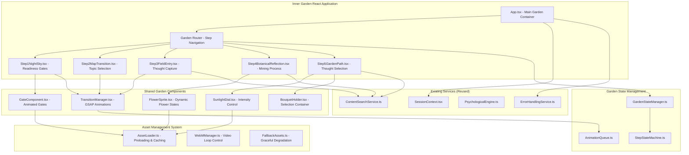
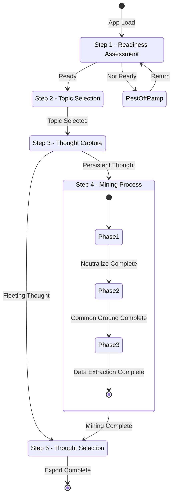

# Inner Garden UI Design Document

## Overview

The Inner Garden UI transforms the existing Clarity Canvas therapeutic tool into an immersive, cinematic experience using garden and botanical metaphors. The design implements a five-step user journey from a contemplative night sky through ornate gates, across a hand-drawn map, into painterly flower fields where users process thoughts through visual and interactive botanical elements. The system maintains all existing therapeutic functionality while providing a more engaging and metaphorically rich interface.

## Architecture

### High-Level System Architecture



### Step Flow Architecture



## Components and Interfaces

### Core Step Components

#### 1. App.tsx - Main Garden Container

```typescript
interface GardenState {
  currentStep:
    | "nightSky"
    | "mapTransition"
    | "fieldEntry"
    | "botanicalReflection"
    | "gardenPath";
  readinessLevel: number; // 0-100
  selectedGate: "open" | "partial" | "closed" | null;
  selectedTopic: "money" | "relationships" | "selfImage" | null;
  userThought: string;
  isPersistentThought: boolean;
  miningResults: MiningResult[];
  selectedThoughts: ThoughtSelection[];
  bouquet: BouquetItem[];
}

const App: React.FC = () => {
  const [gardenState, setGardenState] = useState<GardenState>(initialState);
  const [isTransitioning, setIsTransitioning] = useState(false);

  return (
    <div className="inner-garden-app">
      <AssetPreloader />
      <GardenErrorBoundary>
        <GardenStateProvider value={{ gardenState, setGardenState }}>
          <TransitionManager isActive={isTransitioning}>
            <GardenRouter
              currentStep={gardenState.currentStep}
              onStepChange={handleStepChange}
            />
          </TransitionManager>
        </GardenStateProvider>
      </GardenErrorBoundary>
    </div>
  );
};
```

#### 2. Step1NightSky.tsx - Readiness Assessment

```typescript
interface NightSkyProps {
  onReadinessChange: (level: number, gate: GateType) => void;
  onProceed: () => void;
}

const Step1NightSky: React.FC<NightSkyProps> = ({
  onReadinessChange,
  onProceed,
}) => {
  const [readinessLevel, setReadinessLevel] = useState(50);
  const [selectedGate, setSelectedGate] = useState<GateType | null>(null);
  const [showRestMessage, setShowRestMessage] = useState(false);

  return (
    <section className="night-sky-container">
      {/* Background Layers */}
      <BackgroundLayer
        src="/assets/night_sky_bg.png"
        className="night-sky-base"
      />
      <CloudLayer
        src="/assets/clouds_layer_back.png"
        speed="slow"
        className="clouds-back"
      />
      <StarLayer
        src="/assets/star_twinkle_static.png"
        className="stars-twinkling"
      />
      <CloudLayer
        src="/assets/clouds_layer_front.png"
        speed="fast"
        className="clouds-front"
      />

      {/* Interactive Elements */}
      <div className="gates-container">
        <GateComponent
          type="open"
          label="Ready for Momentum"
          isSelected={selectedGate === "open"}
          glowIntensity={readinessLevel > 70 ? 1 : 0}
        />
        <GateComponent
          type="partial"
          label="Willing & Curious"
          isSelected={selectedGate === "partial"}
          glowIntensity={readinessLevel >= 30 && readinessLevel <= 70 ? 1 : 0}
        />
        <GateComponent
          type="closed"
          label="Emotionally Overwhelmed"
          isSelected={selectedGate === "closed"}
          glowIntensity={readinessLevel < 30 ? 1 : 0}
        />
      </div>

      <ReadinessSlider
        value={readinessLevel}
        onChange={handleReadinessChange}
        className="moonlight-slider"
      />

      {showRestMessage && (
        <RestMessage
          onClose={() => setShowRestMessage(false)}
          onReturn={() => setShowRestMessage(false)}
        />
      )}
    </section>
  );
};
```

#### 3. Step2MapTransition.tsx - Topic Selection

```typescript
interface MapTransitionProps {
  onTopicSelect: (topic: TopicType) => void;
  isTransitioning: boolean;
}

const Step2MapTransition: React.FC<MapTransitionProps> = ({
  onTopicSelect,
  isTransitioning,
}) => {
  const [zoomPhase, setZoomPhase] = useState<
    "fade" | "reveal" | "zoom" | "complete"
  >("fade");
  const [hoveredBed, setHoveredBed] = useState<TopicType | null>(null);

  useEffect(() => {
    if (isTransitioning) {
      executeMapTransition();
    }
  }, [isTransitioning]);

  const executeMapTransition = async () => {
    // Phase 1: Fade out night sky
    setZoomPhase("fade");
    await gsap.to(".night-sky-container", { opacity: 0, duration: 1 });

    // Phase 2: Reveal map
    setZoomPhase("reveal");
    await gsap.to(".map-overlay", { opacity: 1, duration: 1 });

    // Phase 3: Zoom to flower beds
    setZoomPhase("zoom");
    await gsap.to(".map-container", {
      scale: 4,
      x: -200,
      y: -150,
      duration: 2,
      ease: "power2.inOut",
    });

    setZoomPhase("complete");
  };

  return (
    <section className="map-transition-container">
      <div className="sky-to-map-overlay" />

      <div className="map-container">
        

        {zoomPhase === "complete" && (
          <div className="flower-beds-container">
            <TopicBed
              type="money"
              thumbnail="/assets/path_picker_money.png"
              hoverVideo="/assets/path_picker_money.webm"
              isHovered={hoveredBed === "money"}
              onHover={() => setHoveredBed("money")}
              onSelect={() => onTopicSelect("money")}
              position={{ x: "25%", y: "60%" }}
            />

            <TopicBed
              type="relationships"
              thumbnail="/assets/path_picker_relationships.png"
              hoverVideo="/assets/path_picker_relationships.webm"
              isHovered={hoveredBed === "relationships"}
              onHover={() => setHoveredBed("relationships")}
              onSelect={() => onTopicSelect("relationships")}
              position={{ x: "50%", y: "45%" }}
            />

            <TopicBed
              type="selfImage"
              thumbnail="/assets/path_picker_selfimage.png"
              hoverVideo="/assets/path_picker_selfimage.webm"
              isHovered={hoveredBed === "selfImage"}
              onHover={() => setHoveredBed("selfImage")}
              onSelect={() => onTopicSelect("selfImage")}
              position={{ x: "75%", y: "55%" }}
            />

            <div className="selection-prompt">
              <p>Which part of your garden calls for attention?</p>
            </div>
          </div>
        )}
      </div>
    </section>
  );
};
```

#### 4. Step3FieldEntry.tsx - Thought Capture

```typescript
interface FieldEntryProps {
  selectedTopic: TopicType;
  onThoughtSubmit: (thought: string, isPersistent: boolean) => void;
}

const Step3FieldEntry: React.FC<FieldEntryProps> = ({
  selectedTopic,
  onThoughtSubmit,
}) => {
  const [userThought, setUserThought] = useState("");
  const [showPersistenceQuestion, setShowPersistenceQuestion] = useState(false);
  const [diveComplete, setDiveComplete] = useState(false);

  useEffect(() => {
    executeDiveAnimation();
  }, [selectedTopic]);

  const executeDiveAnimation = async () => {
    // Animate dive into field
    await gsap.fromTo(
      ".field-container",
      { scale: 0.8, opacity: 0 },
      { scale: 1, opacity: 1, duration: 1.5, ease: "power2.out" }
    );
    setDiveComplete(true);
  };

  const handleThoughtSubmit = () => {
    if (userThought.trim()) {
      setShowPersistenceQuestion(true);
    }
  };

  const handlePersistenceResponse = (isPersistent: boolean) => {
    onThoughtSubmit(userThought, isPersistent);
  };

  return (
    <section className="field-entry-container">
      <div className="field-background">
        
        <video
          src="/assets/petal_drift_overlay.webm"
          autoPlay
          loop
          muted
          playsInline
          className="petal-drift-overlay"
        />
      </div>

      {diveComplete && (
        <div className="journal-container">
          <div className="journal-card">
            <h2>What thought has been growing in this field?</h2>

            <textarea
              value={userThought}
              onChange={(e) => setUserThought(e.target.value)}
              placeholder="Share the thought that's been on your mind..."
              className="thought-input"
              rows={4}
            />

            {!showPersistenceQuestion ? (
              <button
                onClick={handleThoughtSubmit}
                disabled={!userThought.trim()}
                className="submit-thought-btn"
              >
                Continue
              </button>
            ) : (
              <div className="persistence-question">
                <p>
                  Is this a persistent sprout—one that keeps pushing through?
                </p>
                <div className="persistence-buttons">
                  <button
                    onClick={() => handlePersistenceResponse(true)}
                    className="btn-yes"
                  >
                    Yes, it keeps returning
                  </button>
                  <button
                    onClick={() => handlePersistenceResponse(false)}
                    className="btn-no"
                  >
                    No, it's more fleeting
                  </button>
                </div>
              </div>
            )}
          </div>
        </div>
      )}
    </section>
  );
};
```

#### 5. Step4BotanicalReflection.tsx - Mining Process

```typescript
interface BotanicalReflectionProps {
  selectedTopic: TopicType;
  userThought: string;
  onMiningComplete: (results: MiningResult[]) => void;
}

const Step4BotanicalReflection: React.FC<BotanicalReflectionProps> = ({
  selectedTopic,
  userThought,
  onMiningComplete,
}) => {
  const [currentPhase, setCurrentPhase] = useState<1 | 2 | 3>(1);
  const [flowerState, setFlowerState] = useState<
    "bud" | "neutral" | "fullbloom"
  >("bud");
  const [showRoots, setShowRoots] = useState(false);
  const [miningResults, setMiningResults] = useState<MiningResult[]>([]);

  const phases = [
    {
      id: 1,
      title: "Neutral Observation",
      icon: "/assets/icon_magnifying_glass.png",
      description: "Let's examine this thought with curiosity, not judgment",
    },
    {
      id: 2,
      title: "Root Purpose",
      icon: "/assets/icon_watering_can.png",
      description: "What protective purpose might this thought serve?",
    },
    {
      id: 3,
      title: "New Growth Perspective",
      icon: "/assets/icon_pruning_shears.png",
      description: "How might we nurture a more compassionate view?",
    },
  ];

  const handlePhaseComplete = (result: MiningResult) => {
    const updatedResults = [...miningResults, result];
    setMiningResults(updatedResults);

    if (currentPhase === 1) {
      setFlowerState("neutral");
      setCurrentPhase(2);
    } else if (currentPhase === 2) {
      setShowRoots(true);
      setCurrentPhase(3);
    } else {
      setFlowerState("fullbloom");
      setTimeout(() => onMiningComplete(updatedResults), 1000);
    }
  };

  return (
    <section className="botanical-reflection-container">
      <div className="field-background blurred">
        
      </div>

      <div className="flower-focus-area">
        <FlowerSprite
          topic={selectedTopic}
          state={flowerState}
          showRoots={showRoots}
          className="thought-flower"
        />

        <div className="phase-interface">
          <div className="phase-header">
            
            <h2>{phases[currentPhase - 1].title}</h2>
            <p>{phases[currentPhase - 1].description}</p>
          </div>

          <MiningPhaseCard
            phase={currentPhase}
            topic={selectedTopic}
            userThought={userThought}
            onComplete={handlePhaseComplete}
          />
        </div>

        <div className="phase-progress">
          {phases.map((phase, index) => (
            <div
              key={phase.id}
              className={`progress-dot ${
                index + 1 < currentPhase
                  ? "completed"
                  : index + 1 === currentPhase
                  ? "active"
                  : "pending"
              }`}
            />
          ))}
        </div>
      </div>
    </section>
  );
};
```

#### 6. Step5GardenPath.tsx - Thought Selection

```typescript
interface GardenPathProps {
  selectedTopic: TopicType;
  onBouquetComplete: (bouquet: BouquetItem[]) => void;
}

const Step5GardenPath: React.FC<GardenPathProps> = ({
  selectedTopic,
  onBouquetComplete,
}) => {
  const [sunlightLevel, setSunlightLevel] = useState<"low" | "mid" | "high">(
    "mid"
  );
  const [availableThoughts, setAvailableThoughts] = useState<ThoughtOption[]>(
    []
  );
  const [selectedThoughts, setSelectedThoughts] = useState<BouquetItem[]>([]);
  const [loading, setLoading] = useState(true);

  useEffect(() => {
    loadThoughtOptions();
  }, [selectedTopic, sunlightLevel]);

  const loadThoughtOptions = async () => {
    try {
      setLoading(true);
      const thoughts = await contentSearchService.getReplacementThoughts(
        selectedTopic,
        sunlightLevel
      );
      setAvailableThoughts(thoughts);
    } catch (error) {
      console.error("Failed to load thoughts:", error);
    } finally {
      setLoading(false);
    }
  };

  const handleThoughtSelect = (thought: ThoughtOption) => {
    const bouquetItem: BouquetItem = {
      id: thought.id,
      content: thought.content,
      intensity: sunlightLevel,
      flowerType: `picker_flower_generic${
        Math.floor(Math.random() * 16) + 1
      }.png`,
    };

    setSelectedThoughts((prev) => [...prev, bouquetItem]);

    // Animate flower to bouquet
    animateFlowerToBouquet(thought.id);
  };

  const animateFlowerToBouquet = (thoughtId: string) => {
    const flowerElement = document.querySelector(
      `[data-thought-id="${thoughtId}"]`
    );
    const bouquetElement = document.querySelector(".bouquet-holder");

    if (flowerElement && bouquetElement) {
      gsap.to(flowerElement, {
        x: bouquetElement.getBoundingClientRect().left,
        y: bouquetElement.getBoundingClientRect().top,
        scale: 0.5,
        duration: 1,
        ease: "power2.inOut",
        onComplete: () => {
          flowerElement.remove();
        },
      });
    }
  };

  return (
    <section className="garden-path-container">
      <div className="field-background sharp">
        

        <SunlightOverlay level={sunlightLevel} />
      </div>

      <SunlightDial
        level={sunlightLevel}
        onChange={setSunlightLevel}
        className="sunlight-control"
      />

      <div className="thought-flowers-grid">
        {loading ? (
          <div className="loading-flowers">
            <p>Gathering thoughts from the garden...</p>
          </div>
        ) : (
          availableThoughts.map((thought, index) => (
            <ThoughtFlower
              key={thought.id}
              thought={thought}
              flowerImage={`/assets/picker_flower_generic${
                (index % 16) + 1
              }.png`}
              onSelect={() => handleThoughtSelect(thought)}
              className="pickable-flower"
              data-thought-id={thought.id}
            />
          ))
        )}
      </div>

      <BouquetHolder
        selectedThoughts={selectedThoughts}
        onExport={() => onBouquetComplete(selectedThoughts)}
        className="bouquet-container"
      />
    </section>
  );
};
```

### Shared Components

#### 7. GateComponent.tsx - Animated Garden Gates

```typescript
interface GateComponentProps {
  type: "open" | "partial" | "closed";
  label: string;
  isSelected: boolean;
  glowIntensity: number;
}

const GateComponent: React.FC<GateComponentProps> = ({
  type,
  label,
  isSelected,
  glowIntensity,
}) => {
  return (
    <div className={`gate-component gate-${type}`}>
      <div className="gate-visual">
        

        <video
          src={`/assets/gate_vines_${type === "open" ? "wideopen" : type}.webm`}
          autoPlay
          loop
          muted
          playsInline
          className="gate-vines"
        />

        
      </div>

      <div className="gate-label">
        <p>{label}</p>
      </div>
    </div>
  );
};
```

#### 8. FlowerSprite.tsx - Dynamic Flower States

```typescript
interface FlowerSpriteProps {
  topic: TopicType;
  state: "bud" | "neutral" | "fullbloom" | "wilted";
  showRoots?: boolean;
  className?: string;
}

const FlowerSprite: React.FC<FlowerSpriteProps> = ({
  topic,
  state,
  showRoots = false,
  className,
}) => {
  const [currentState, setCurrentState] = useState(state);

  useEffect(() => {
    if (state !== currentState) {
      animateStateChange(state);
    }
  }, [state]);

  const animateStateChange = (newState: string) => {
    gsap.to(`.flower-${currentState}`, {
      opacity: 0,
      scale: 0.9,
      duration: 0.3,
      onComplete: () => {
        setCurrentState(newState as any);
        gsap.fromTo(
          `.flower-${newState}`,
          { opacity: 0, scale: 1.1 },
          { opacity: 1, scale: 1, duration: 0.3 }
        );
      },
    });
  };

  return (
    <div className={`flower-sprite ${className}`}>
      

      {showRoots && (
        <video
          src="/assets/flower_roots_dynamic.webm"
          autoPlay
          loop
          muted
          playsInline
          className="flower-roots"
        />
      )}
    </div>
  );
};
```

#### 9. SunlightDial.tsx - Intensity Control

```typescript
interface SunlightDialProps {
  level: "low" | "mid" | "high";
  onChange: (level: "low" | "mid" | "high") => void;
  className?: string;
}

const SunlightDial: React.FC<SunlightDialProps> = ({
  level,
  onChange,
  className,
}) => {
  const [isDragging, setIsDragging] = useState(false);
  const [rotation, setRotation] = useState(0);

  const levelToRotation = {
    low: -45,
    mid: 0,
    high: 45,
  };

  const rotationToLevel = (rot: number): "low" | "mid" | "high" => {
    if (rot < -22.5) return "low";
    if (rot > 22.5) return "high";
    return "mid";
  };

  useEffect(() => {
    setRotation(levelToRotation[level]);
  }, [level]);

  const handlePointerDown = (e: React.PointerEvent) => {
    setIsDragging(true);
    e.currentTarget.setPointerCapture(e.pointerId);
  };

  const handlePointerMove = (e: React.PointerEvent) => {
    if (!isDragging) return;

    const rect = e.currentTarget.getBoundingClientRect();
    const centerX = rect.left + rect.width / 2;
    const centerY = rect.top + rect.height / 2;

    const angle =
      Math.atan2(e.clientY - centerY, e.clientX - centerX) * (180 / Math.PI);
    const constrainedAngle = Math.max(-45, Math.min(45, angle));

    setRotation(constrainedAngle);
    onChange(rotationToLevel(constrainedAngle));
  };

  const handlePointerUp = (e: React.PointerEvent) => {
    setIsDragging(false);
    e.currentTarget.releasePointerCapture(e.pointerId);
  };

  return (
    <div className={`sunlight-dial ${className}`}>
      

      

      <div className="dial-labels">
        <span className="label-low">Gentle</span>
        <span className="label-mid">Balanced</span>
        <span className="label-high">Transformative</span>
      </div>
    </div>
  );
};
```

## Data Models

### Garden State Model

```typescript
interface GardenState {
  // Navigation
  currentStep: StepType;
  stepHistory: StepType[];
  canGoBack: boolean;

  // Step 1: Night Sky
  readinessLevel: number; // 0-100
  selectedGate: GateType | null;
  showRestMessage: boolean;

  // Step 2: Map Transition
  transitionPhase: "fade" | "reveal" | "zoom" | "complete";
  selectedTopic: TopicType | null;

  // Step 3: Field Entry
  userThought: string;
  isPersistentThought: boolean;

  // Step 4: Botanical Reflection
  currentMiningPhase: 1 | 2 | 3;
  flowerState: FlowerState;
  miningResults: MiningResult[];

  // Step 5: Garden Path
  sunlightLevel: SunlightLevel;
  availableThoughts: ThoughtOption[];
  selectedThoughts: BouquetItem[];

  // Export & Session
  sessionInsights: SessionInsight[];
  exportData: ExportData | null;
}

interface MiningResult {
  phase: 1 | 2 | 3;
  type: "neutralize" | "commonGround" | "dataExtraction";
  userInput: string;
  selectedPrompts: string[];
  timestamp: string;
}

interface BouquetItem {
  id: string;
  content: string;
  intensity: SunlightLevel;
  flowerType: string;
  position: { x: number; y: number };
}

interface ThoughtOption {
  id: string;
  content: string;
  category: string;
  subcategory: string;
  intensity: SunlightLevel;
  tags: string[];
}
```

### Animation State Model

```typescript
interface AnimationState {
  // Global animation control
  isAnimating: boolean;
  currentAnimation: string | null;
  animationQueue: AnimationQueueItem[];

  // Step-specific animations
  nightSkyAnimations: {
    cloudsBack: boolean;
    cloudsFront: boolean;
    starsTwinkling: boolean;
    gateGlows: Record<GateType, number>;
  };

  mapTransitionAnimations: {
    skyFadeOut: boolean;
    mapReveal: boolean;
    zoomToFlowerBeds: boolean;
  };

  fieldEntryAnimations: {
    diveIntoField: boolean;
    journalAppear: boolean;
    petalDrift: boolean;
  };

  botanicalReflectionAnimations: {
    flowerTransformation: boolean;
    rootsGrowth: boolean;
    phaseTransitions: boolean;
  };

  gardenPathAnimations: {
    sunlightOverlay: boolean;
    flowerWiggle: boolean;
    bouquetCollection: boolean;
  };
}

interface AnimationQueueItem {
  id: string;
  type: "gsap" | "css" | "webm";
  target: string;
  properties: Record<string, any>;
  duration: number;
  delay?: number;
  onComplete?: () => void;
}
```

## Error Handling

### Asset Loading Failures

- **Progressive Loading**: Critical assets loaded first, decorative assets loaded progressively
- **Fallback Assets**: Simple PNG fallbacks for complex WebM animations
- **Graceful Degradation**: Interface remains functional even with missing assets
- **Retry Mechanisms**: Automatic retry for failed asset loads with exponential backoff

### Animation Failures

- **GSAP Fallbacks**: CSS transitions used when GSAP fails to load
- **Performance Monitoring**: Frame rate monitoring with automatic quality reduction
- **Reduced Motion Support**: Respect user preferences for reduced motion
- **Animation Queuing**: Prevent animation conflicts with proper queuing system

### Content Loading Failures

- **Service Integration**: Reuse existing ContentSearchService error handling
- **Cached Content**: Local storage fallbacks for critical content
- **User Feedback**: Clear messaging when content is unavailable
- **Partial Functionality**: Core features work even with limited content

## Testing Strategy

### Visual Regression Testing

- **Screenshot Comparison**: Automated visual testing for each step
- **Animation Testing**: Frame-by-frame validation of key animations
- **Cross-Browser Testing**: Visual consistency across modern browsers
- **Device Testing**: Layout and interaction testing on various screen sizes

### Interaction Testing

- **User Journey Testing**: Complete flows from night sky to export
- **Animation Timing**: Validation of animation sequences and timing
- **Asset Loading**: Testing of progressive loading and fallback scenarios
- **Performance Testing**: Frame rate and memory usage validation

### Accessibility Testing

- **Keyboard Navigation**: Full keyboard accessibility for all interactions
- **Screen Reader Testing**: Proper ARIA labels and descriptions
- **Color Contrast**: WCAG compliance for all visual elements
- **Reduced Motion**: Testing of reduced motion alternatives

## Performance Considerations

### Asset Optimization

- **Image Compression**: Optimized PNG and WebM files for web delivery
- **Progressive Loading**: Critical path assets loaded first
- **Lazy Loading**: Non-critical assets loaded on demand
- **Caching Strategy**: Aggressive caching for static assets

### Animation Performance

- **Hardware Acceleration**: CSS transforms and opacity for smooth animations
- **Frame Rate Monitoring**: Automatic quality reduction on low-end devices
- **Animation Batching**: Efficient batching of simultaneous animations
- **Memory Management**: Proper cleanup of animation resources

### Bundle Optimization

- **Code Splitting**: Step components loaded on demand
- **Tree Shaking**: Unused code eliminated from bundles
- **Compression**: Gzip/Brotli compression for all assets
- **CDN Integration**: Static assets served from CDN when available

## Implementation Considerations

### Existing System Integration

- **Service Reuse**: Leverage existing ContentSearchService and SessionContext
- **Content Pipeline**: Use existing content structure and build process
- **AI Integration**: Maintain compatibility with existing PsychologicalEngine
- **Error Handling**: Extend existing ErrorHandlingService for garden-specific errors

### Migration Strategy

- **Feature Flags**: Toggle between existing canvas and new garden interface
- **Parallel Development**: Build garden interface alongside existing system
- **User Testing**: Beta testing with subset of users before full rollout
- **Rollback Plan**: Quick rollback to existing interface if issues arise

### Maintenance and Updates

- **Asset Management**: Organized asset structure for easy updates
- **Component Architecture**: Modular components for easy maintenance
- **Documentation**: Comprehensive documentation for future developers
- **Monitoring**: Performance and error monitoring for production issues
